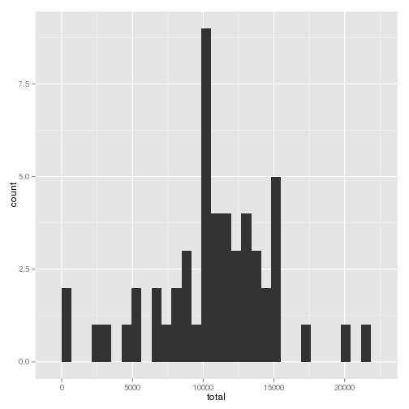
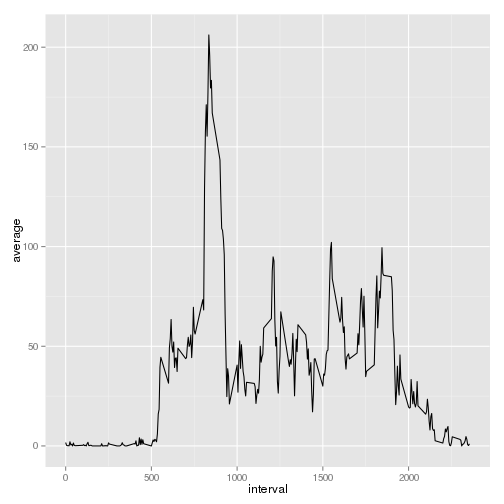
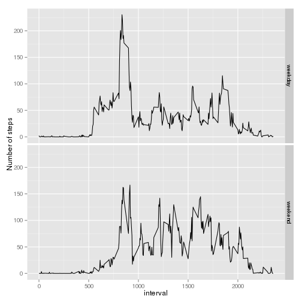

## Loading and preprocessing the data

We unzip and load the data using

```r
unzip('activity.zip')
data <- read.csv('activity.csv',header=TRUE)
```
and convert the date field to a proper format

```r
data$date <- as.POSIXct(data$date,'%Y-%m-%d')
```

## What is mean total number of steps taken per day?

We make use of these libraries

```r
library(dplyr)
```

```
## 
## Attaching package: 'dplyr'
## 
## The following object is masked from 'package:stats':
## 
##     filter
## 
## The following objects are masked from 'package:base':
## 
##     intersect, setdiff, setequal, union
```

```r
library(ggplot2)
```

The data are grouped by *date* and the overall number of steps per day computed

```r
data_by_date <- data %>% group_by(date) %>% summarise(steps=sum(steps))
```

The histogram is plotted

```r
g <- ggplot(data_by_date, aes(steps))
g <- g + geom_histogram()
print(g)
```

```
## stat_bin: binwidth defaulted to range/30. Use 'binwidth = x' to adjust this.
```

 

The mean and the median of steps per day are obtained through

```r
mean(data_by_date$steps,na.rm=TRUE)
```

```
## [1] 10766.19
```

```r
median(data_by_date$steps,na.rm=TRUE)
```

```
## [1] 10765
```

## What is the average daily activity pattern?

We first group the data by *interval*, and compute the mean for each group ignoring NA values

```r
data_by_interval <- data %>% group_by(interval) %>% summarise(average=mean(steps,na.rm=TRUE))
```

The average for each interval is plotted

```r
g <- ggplot(data_by_interval, aes(interval,average))
g <- g + geom_line()
print(g)
```

 

The interval with the maximum number of steps is obtained as

```r
data_by_interval$interval[which.max(data_by_interval$average)]
```

```
## [1] 835
```

## Imputing missing values

The number of rows with one or more NA values is found out through

```r
sum(!complete.cases(data))
```

```
## [1] 2304
```

In order to fill in the missing values, we 
- add a new column to the data containing the average steps of the interval by means of *merge*
- set every NA value of the *steps* to the corresponding value in that new auxiliar column 
- remove the auxiliar column in the end.

```r
data_filled <- merge(data,rename(data_by_interval,average_steps=average))
data_filled[is.na(data_filled$steps),'steps'] = data_filled[is.na(data_filled$steps),'average_steps']
data_filled <- select(data_filled,-average_steps)
```

We compute the total number of steps per day along with its mean and median for the new dataset.

```r
data_filled_by_date <- data_filled %>% group_by(date) %>% summarise(steps=sum(steps))
mean(data_filled_by_date$steps,na.rm=TRUE)
```

```
## [1] 10766.19
```

```r
median(data_filled_by_date$steps,na.rm=TRUE)
```

```
## [1] 10766.19
```

Only the median is different and the impact is negligible.

## Are there differences in activity patterns between weekdays and weekends?

We build a new dataset by

- adding a new (factor) column *day* specifiying whether the interval corresponds to a week day or the weekend
- grouping by *interval* and the newly added column
- averaging


```r
data_filled_by_date_and_weekday <- data_filled %>% 
	mutate(day = factor(weekdays(date) == 'sábado' | weekdays(date) == 'domingo',
						levels=c(FALSE,TRUE),labels=c('weekday','weekend'))) %>%
	group_by(interval,day) %>% summarise(average=mean(steps,na.rm=TRUE))
```
The new dataset is named *data_filled_by_date_and_weekday*.

We make a panel plot with *day* being the separating variable

```r
g <- ggplot(data_filled_by_date_and_weekday, aes(interval,average))
g <- g + facet_grid(day ~ .) + geom_line() + labs(y='Number of steps')
print(g)
```

 
